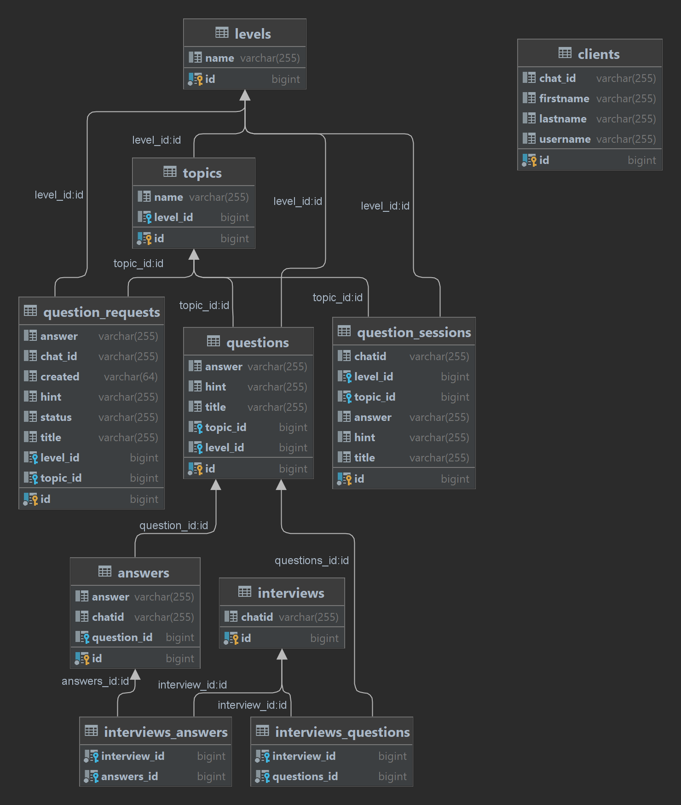

<h1>Spring Boot Telegram Bot</h1>
<h2>Java questions</h2>

This project is under development

This is an application that allows collect, share and get answers to Java interview questions. This bot is developed to help with interview preparation. 
Telegram Bot application is developed with Spring Boot framework and PostgreSQL database. 
Buttons and commands are presented as Controller endpoints, and logic is implemented in Service classes with JPA Repository injection. 

<!--SPACE 20PX -->

<h3>Contents</h3>
<ul>
    <li>
Introduction
</li>
    <li>
Technologies stack
</li>
    <li>
Short classes and repositories structure overview
</li>
    <li>
Functionality description
</li>
    <li>
Database structure
</li>
    <li>
Conclusion
</li>
</ul>

<!--SPACE 20PX -->

<h3>Technologies stack</h3>
<ul>
    <li>
Spring boot
</li>
    <li>
PostgreSQL
</li>
    <li>
JUnit
</li>
    <li>
Telegram Bot API
</li>
    <li>
Amazon AWS
</li>
</ul>

<!--SPACE 20PX -->

<h3>Short classes and repositories structure overview</h3>

There is a simple for code review structure that divides files according to their purpose
and functionality:

<ol>
    <li>
bot repository where all the classes and interfaces related to the 
Bot entity are placed, including session, messages sender implementation, model and configuration file.
</li>
    <li>
controller repository contains classes that allows to handle requests from UI as well as web controller class with
endpoints for database administration.
</li>
    <li>
domain repository contains classes of POJO entities that is related to database development.
</li>
    <li>
repository contains interfaces that extend JpaRepository interface and may include custom SQL requests to database.
</li>
    <li>
service repository contains interfaces with methods related to the logic of the application. There are also classes with realisations 
of methods in service interfaces. Methods are related to requests from UI logic and also entities CRUD methods.
</li>
</ol>

<!--SPACE 20PX -->

<h3>Functionality description</h3>

The list of commands allowed in this bot:

<ul>
    <li>
/start

        
Allows begin working with the bot in telegram application
</li>
    <li>
/reset

        
Allows return to the main menu and reset all the requests before
</li>
    <li>
/help

        
Sends message with the functionality and main commands description
</li>
</ul>

The list of possible actions that this bot can handle

<ul>
    <li>
Read Java questions and answers

        
All questions divided into categories and levels. 
</li>
    <li>
Send request for adding new question

        
Each user can be an author of questions by sending request for verification.
</li>
    <li>
Pass an interview

        
User can try to pass an interview and answer several questions from each topic according 
to user's level of knowledge.
</li>
</ul>

<!--SPACE 20PX -->

<h3>Database structure</h3>

    

<h3>Conclusion</h3>

This project helps me to fill out my gaps before interviews and make my knowledge base stronger. 
Moreover, I practiced with Spring boot framework and tried to create clear and scalable application. 

